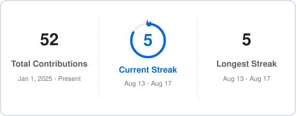

<!-- Header Wave Banner -->

  

<!-- Dynamic Typing SVG Headline -->

  
   

  <!-- Metric Badges -->
  

    
    
    
  

---

### 🌟 About Me & Engineering Vision

Hello! I am a passionate **Software Engineer** dedicated to building clean, scalable, and high-performance software systems. I thrive at the intersection of modern frontend elegance and powerful backend architecture.

- 🔭 **Current Focus:** Designing full-stack web applications and micro-architectures.
- 💡 **Core Philosophy:** Writing readable, maintainable code that solves real-world problems.
- 🌱 **Exploring:** Scalable backend patterns, TypeScript ecosystems, and cloud-native solutions.
- ⚡ **Hobbies:** Tech blogging, exploring open-source tools, and experimenting with UI/UX.
- 📫 **Reach Out:** Always open for discussions, code reviews, and networking!

 

---

### 🚀 Featured & Open Source Projects

| 🎁 Project & Architecture | 🛠️ Tech Stack & Toolkit | 🌟 Stars | 🍴 Forks | 🔔 Issues | 📬 Pull Requests |
| :--- | :--- | :---: | :---: | :---: | :---: |
| [**Portfolio Profile README**](https://github.com/snmrayhan-dev/snmrayhan-dev) Interactive, dynamic GitHub portfolio showcase | `Markdown` `SVG` `GitHub Actions` |  |  |  |  |
| [**GitHub Automation & Badges**](https://github.com/snmrayhan-dev/badge-unlocker) Automated CI/CD workflows and achievement suite | `Git` `Shell` `GitHub CLI` |  |  |  |  |
| [**Full-Stack Web Architecture**](https://github.com/snmrayhan-dev) Scalable SaaS template with authentication & API integration | `TypeScript` `Next.js` `Tailwind` `Prisma` |  |  |  |  |
| [**Backend RESTful API Service**](https://github.com/snmrayhan-dev) High-performance API server with JWT security & Docker | `Node.js` `Express` `PostgreSQL` `Docker` |  |  |  |  |

---

### 🎯 Core Competencies

<table>
<tr>
<td width="50%" valign="top">
<h4>🌐 Full-Stack Web Development</h4>

Building responsive, accessible, and high-speed web apps with modern frameworks and component-driven architecture.

</td>
<td width="50%" valign="top">
<h4>⚙️ Backend & API Architecture</h4>

Designing RESTful endpoints, data validation layers, authentication flows, and reliable database schemas.

</td>
</tr>
<tr>
<td width="50%" valign="top">
<h4>🗄️ Database Management</h4>

Structuring relational and NoSQL databases with query optimization, indexing, and data integrity in mind.

</td>
<td width="50%" valign="top">
<h4>🚀 Version Control & DevOps</h4>

Adhering to Git workflows, CI/CD automated pipelines, and standard containerized development practices.

</td>
</tr>
</table>

---

### 🛠️ Comprehensive Tech Stack & Toolkit

#### 💻 Programming Languages

  
  
  
  
  
  
  

#### ⚛️ Frameworks, Libraries & Runtimes

  
  
  
  
  
  
  

#### 🗄️ Databases, Cloud & Storage

  
  
  
  
  

#### 🧰 Developer Tools & Environments

  
  
  
  
  
  
  
  

---

### 📈 GitHub Contribution Streak & Activity Wave

  

    
  

   
  

---

### 🤝 Connect & Collaborate

  
  
  

<i>💡 "The only way to do great work is to love what you do."</i>

<!-- Footer Wave Banner -->

  

